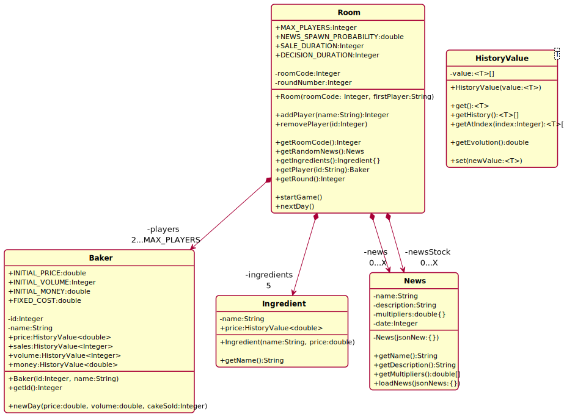

# Document de travail T4

Projet : **PEC22 : Producteurs et consommateurs : les mécanismes du marché face aux changements de contexte**

| Rédacteurs :     |
| ---------------- |
| Derya AY         |
| Eren CEYLAN      |
| Franck GUTMANN   |
| Clément NOGUEIRA |

- URL GIT : https://git.unistra.fr/les-scrums-masters/pec22-t4-a
- URL Cahier des charges version google doc : https://docs.google.com/document/d/1XzKFFJWGTYIfo0v8qdau2wIX_IKBXGIUGRrV3Ha9yFI/
- Jeu en ligne : http://cakeit.franck-g.fr/

## Description des objectifs pédagogiques du jeu

### Objectif pédagogique général

Comment les mécanismes du marché influent sur les décisions des producteurs face aux circonstances extérieures.

### Description des objectifs pédagogiques

Les détails de ce que le joueur doit apprendre.

Selon la théorie, sur un marché en Concurrence Pur et Parfaite (CPP),
le prix des biens est fixé par un équilibre entre offre et demande. L’offre s’adapte à la demande et vice-versa, et ces derniers peuvent impacter l’évolution du prix et du volume de production.
L’équilibre entre l’offre et la demande peut être modifié par des chocs, ce sont des évènements extérieurs qui viennent régulièrement impacter l’offre ou la demande. Ces changements violents ont le pouvoir de créer un bouleversement au plan économique.
Il y a deux types de conséquences, qui peuvent à la fois être positives ou négatives :

- **Choc sur la demande** : peur de la pénurie entraîne une hausse de la demande ou un scandale sur l'hygiène d’une industrie fait chuter la demande.
- **Choc sur l’offre** : pénuries entraînent une augmentation du prix des matières premières (négatif) ou innovation permettant une meilleure productivité (positif).

## Description de l’Unité d’Enseignement 1

**Description de la connaissance 1**

#### Marché :

- Le marché est un lien fictif où se rencontrent l’offre et la demande.

#### Mécanismes du marché

- Les prix des produits : quand le prix augmentent, la demande diminue
- Le revenu du consommateur : quand le revenu augmente, la demande diminue.
- Les goûts car les consommateurs ont des préférences

#### Choc de l’offre :

- La notion de choc de l’offre désigne une variation importante et imprévue des conditions de production qui affecte les producteurs.
- Elle modifie les coûts de production des biens et se traduit par une variations des prix demandés par les entreprises. On peut aussi parler de **choc de prix**.
- Les chocs d’offre ou/et de demande peuvent générer des périodes d’expansion (choc positif) ou provoquer des crises économiques (choc négatif).

## Description du jeu

**Type de jeu** : Gestion

**Incarnation du joueur** : Un boulanger/Grand producteur de g$ateau aux chocolats

**Déroulement d’une partie**

Description du déroulement d’une partie : début, déroulement et fin

Nous avons créé un jeu multijoueur. Les joueurs incarnent des boulangeries en concurrence. Les boulangeries ne vendent qu’un seul produit : des gâteaux aux chocolats. Un gâteau est composé d'une unité d'ingrédients.
Les habitants de ce monde merveilleux ne peuvent pas vivre bien longtemps sans gâteaux aux chocolats.

Pour chaque tour, le joueur peut modifier le prix et le volume de production.
La seule information qu’ils peuvent connaître de leur concurrent est le prix à laquelle ils commercialisent leurs gâteaux. Les jours se déroulent, et les ventes se font toutes seules.

Chaque matin, les boulangers peuvent consulter leurs résultats et peuvent adapter leurs paramètres s'ils le souhaitent. Et certains jours, une ou plusieurs actualités surviennent.
A ce moment-là, les boulangeries mettent en pause leur production et analysent les évolutions du prix des matières premières, ou un changement de la demande des consommateurs. Et d’après ces paramètres, les différentes boulangeries adaptent ou non leur prix et leurs volumes de production. Les joueurs ont un temps limité pour effectuer des changements s’ils le souhaitent. Un tour dure 1 seul jour. Le jeu se termine au bout de 15 tours. Et le boulanger ayant le plus grand profit gagne le jeu.

## Paramétrage d’une partie

Description des options permettant de paramétrer une partie.

- **Nombre de joueur** : 2-X joueurs, chacun joue sur son appareil. Chaque joueur est en concurrence avec tous les autres
- **Nom du joueur**
- **Numéro du salon** s’il souhaite jouer à plusieurs
- **Nombre de tours** : 10 tours de jeu avec 1 tour correspondant à 1 jour
- **Pourcentage d'événement**

- **Prix initial des matières premières**
- **Prix initial et volume de vente initial**

## Modèle conceptuel applicatif

Voici notre diagramme de classe décrivant notre jeu :

## Description des fonctionnalités

### Actions du joueur

Liste des actions possibles par le joueur.

#### Gestion des tours :

- **Augmenter ou diminuer** le prix des gâteaux aux chocolats
- **Augmenter ou diminuer** le volume de sa production

#### Gestion des tâches

- **Examiner** les graphiques mises à disposition afin de prendre des décisions

### Informations au joueur

Liste des informations présentées au joueurs.

#### Gestion des tours

- **Date actuelle** : la date d'aujourd'hui
- **Trésorerie de la boulangerie** : trésorerie de la boulangerie
- **Actualités** : les actualités de la journée, ce sont les changement de contexte
- **Concurrents** : les concurrents ce sont les autres boulangeries
  - **Prix de vente des concurrents** : le prix que les concurrents ont fixé pour les gâteaux aux chocolats
  - **Trésorerie** : la trésorerie des concurrents
- **Bilan de la veille du boulanger** : données de la boulangerie
  - **Gâteaux en rayon** : nombre de gâteau en rayon
  - **Prix de vente du gâteau** : prix du gâteau
  - **Gâteaux vendus** : nombre de gâteau vendus
- **Graphiques** : graphiques montrant l’évolution des prix des matières premières (Chocolat, Farine, Beurre, Sucre et Oeufs) en fonction du temps. Attention un gâteau est composé d'une unité d'ingrédients.

#### Exemples d’événements :

- Un plan de relance économique est en marche.
- Un nouveau confinement ?
- Le spectre de la sécheresse plane déjà
- Bricomarché cherche 1000 salariés
- Nouvelle journée de grève dans les transports !

### Moteur interne

Liste des interactions entre les actions du joueurs et les informations

#### Gestion des tours

Pendant le tour actuel, le joueur prend les décisions pour le tour suivant.

- **Augmenter le prix des gâteaux** : Prix de ventes lendemain ++

- **Diminuer le prix des gâteaux** : Prix de ventes lendemain - -

- **Augmenter le volume de la production** : Gâteaux en rayon lendemain ++

- **Diminuer le volume de la production** : Gâteaux en rayon lendemain - -

# Scénarios

## Scénario tutorial

Décrire en détail un scénario qui s’appuie sur toutes les fonctionnalités mais sans difficulté pour le joueur.

- Tutorial pour comprendre les mécanismes du marché face aux changement de contexte
  Voici un exemple :
  Paramètres :
- Joueur : [<Nom, Prix Gâteau, * Production, Trésorerie>] ,[Nadège, 10, 1000, 100 000]
  Concurrent : [<Nom, Prix Gâteau, Trésorerie>]
  [<Alice,10,1000,100 000>]
- Nombres de tours : 3
- Actualités qui créent un choc

### Déroulement gagnant :

- 1.1 Une actualité survient : Hausse du pouvoir d’achat des consommateurs
- 1.2. Les joueurs analysent les graphiques l’actualité et prennent des décisions.Nadège a choisi d’augmenter sa production et ses prix [<Nadège, 15,1080, 100500>]
  Alice a baissé sa production <Alice,10,800,99700>
- 1.3. Nadège va faire le plus de profits car elle va vendre plus que sa concurrente. Car hausse du pouvoir d'achat est un choc de demande positif qui se traduit par une hausse de la production et des prix.

---

- 2.1. Une autre actualité survient : Pénurie
- 2.2. Les concurrents analysent la trésorerie et le nombre de ventes de leurs concurrents. Analyse les graphiques qui affichent le prix des matières premières
- 2.3 Prennent des décisions en ajustant la production et le prix

---

- 3. Même chose pour le tour numéro 3
     Celui qui a le plus augmenté son profit au cours du jeu gagne.

### Déroulement perdant :

Même acheminement pour perdre :
S'il fait moins de profit que son concurrent à chaque partie, le joueur va perdre. A la fin on regarde celui qui a fait le moins de profit du début de la partie à la fin.

### Scénarios complémentaires

Décrire moins précisément d’autres idées de scénarios.

- Si le joueur ne possède aucune notion en économie. Le scénario ne permet pas au joueur d'être à 100% sûr du résultat. S'il ne sait pas la différence entre choc d'offres et choc de demande et il ne saura pas quel action et le plus adapté entre diminuer et augmenter le prix et la production.

### Fonctionnalités additionnelles

Décrire ici les idées de fonctionnalités additionnelles. Cette partie ne doit servir qu’en dernier recours, pour transmettre ce qui n’a pas été inclus dans les fonctionnalités faute de temps.

- Permettre aux joueurs de déclencher des chocs par eux-mêmes et ne pas toujours les subir.
- Ajouter la notion de salaires pour les employés des boulangeries.
- Ajouter la notion de coup invariable exemple avec le loyer
- Implémenter un compteur qui indique les joueurs n'ayant pas encore validé leur tour.
- Ajouter un classement prenant en compte les autres parties

# Règles de nommages

- fichiers, variables : camelCase, exemple : app.js
- classes : PascalCase, exemple : App
- constantes : screaming snake, exemple : MY_URL
