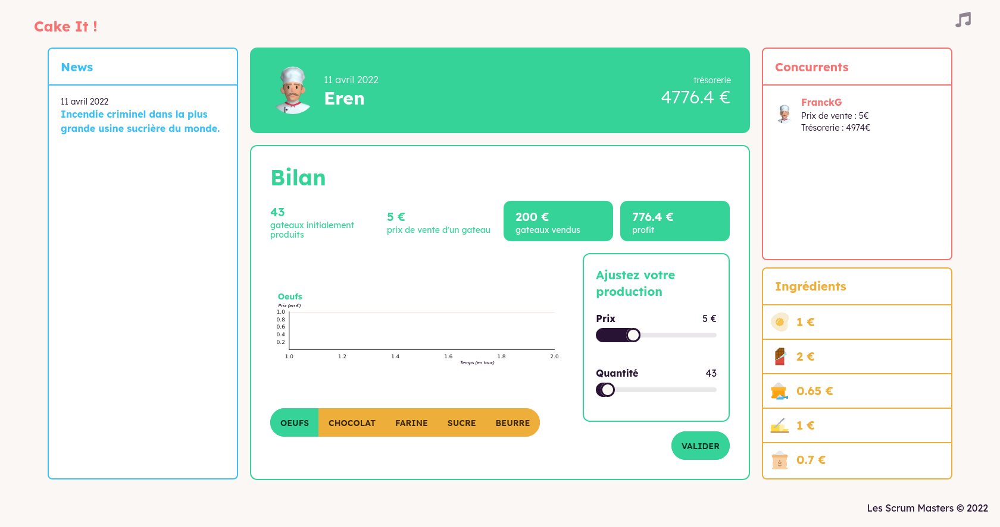
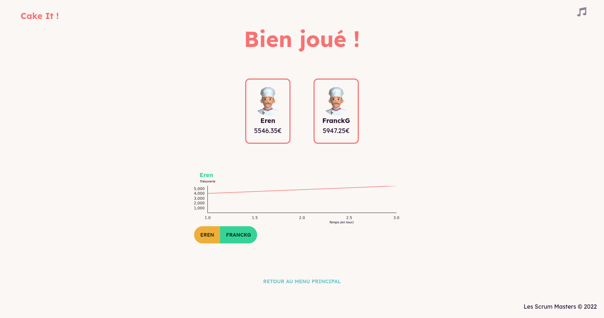

# PEC22-T3-A : Les Scrums Master

- **Thème** : Microéconomie
- **Durée du développement** : 3 jours
- **Nom du jeu** : Cake it !
- **Langages utilisés** : React

# 📃 Présentation du projet :

Notre projet tutoré consiste à concevoir un jeu sérieux scientifique bien défni sur un sujet donné en groupe de 4 personnes. Notre sujet ici les mécanismes du marché face aux changements de contexte. Nous avons donc conçu un jeu, qui s'appelle Cake it, qui permet de montrer aux joueurs comment les mécanismes du marché influent sur les décisions des producteurs face aux circonstances extérieures.

Prenez la peau d'un boulanger et gérer au mieux votre production afin de maximiser votre profit !

(Ajout screen)

# ℹ Informations

[Cliquez ici pour accéder au cahier des charges](./CDD.md)

# 💻 Site en ligne

Nous avons mis le jeu en ligne à cette adresse :

(image)

# 🛠️ Procédure d'installation

## Prérequis

- Installer [Node.js](https://nodejs.org/en/download/)
- Installer [git](https://git-scm.com/downloads) pour pouvoir cloner le projet

## Clôner le projet

Se rendre dans le dossier où vous voulez clôner le projet

```bash
cd /home/.../dossierOuJeSouhaiteCloner
```

Avec une clé SSH

```bash
git clone git@git.unistra.fr:les-scrums-masters/pec22-t4-a.git
```

Avec HTTPS

```bash
git clone
https://git.unistra.fr/les-scrums-masters/pec22-t4-a.git
```

## Installer les dépendances Node.js

Au sein du dossier `/pec22-t4-a/client` et `/pec22-t4-a/server`, exécuter la commande

```
npm install
```

## Démarrer le serveur Node.js

Au sein du dossier `/pec22-t4-a/client`, exécuter la commande

```
npm run start
```

L'application est alors disponible à l'adresse http://localhost:3000/

## **📷 Galerie**

<table>
    <thead>
        <tr>
            <th>Menu principal</th>
            <th>Menu de création de party</th>
        </tr>
    </thead>
    <tbody>
        <tr>
            <td></td>
            <td></td>
        </tr>
    </tbody>
     <thead>
        <tr>
            <th>Lobby d'attente</th>
            <th>Evenement arrivé</th>
        </tr>
    </thead>
    <tbody>
        <tr>
            <td></td>
            <td></td>
        </tr>
    </tbody>
    <thead>
        <tr>
            <th>Menu de jeu</th>
            <th>Fin de partie</th>
        </tr>
    </thead>
    <tbody>
        <tr>
            <td></td>
            <td></td>
        </tr>
    </tbody>
</table>
