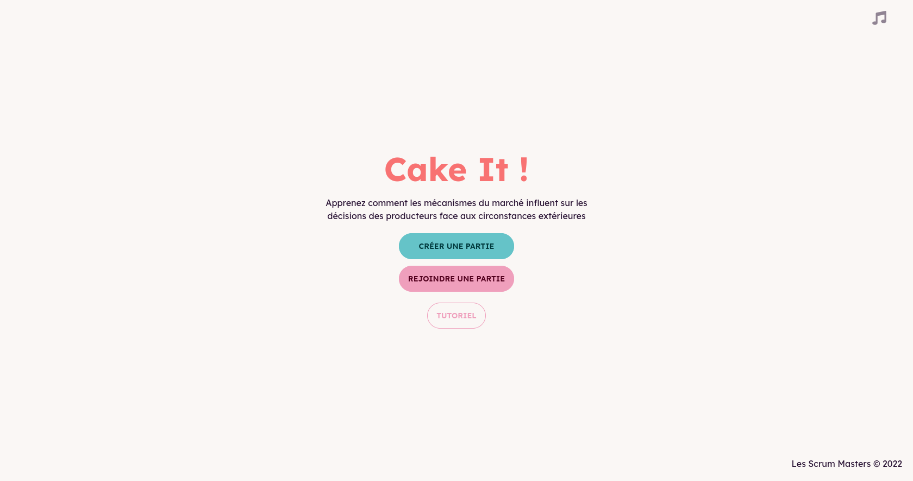
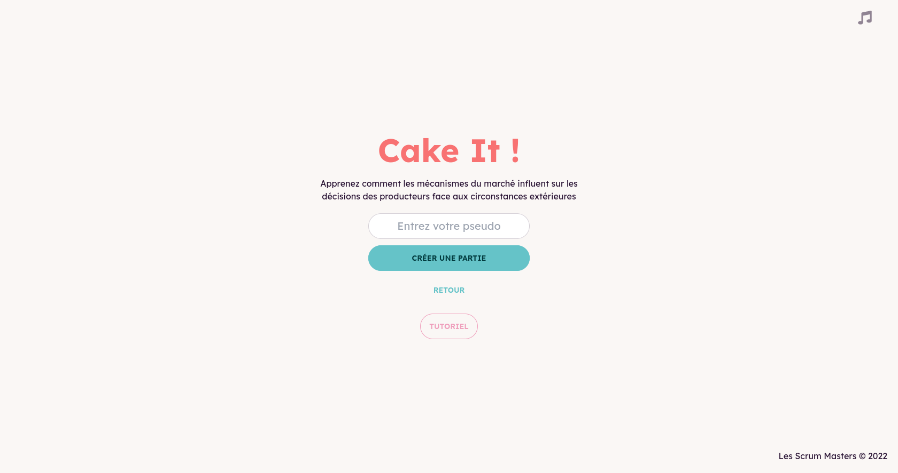
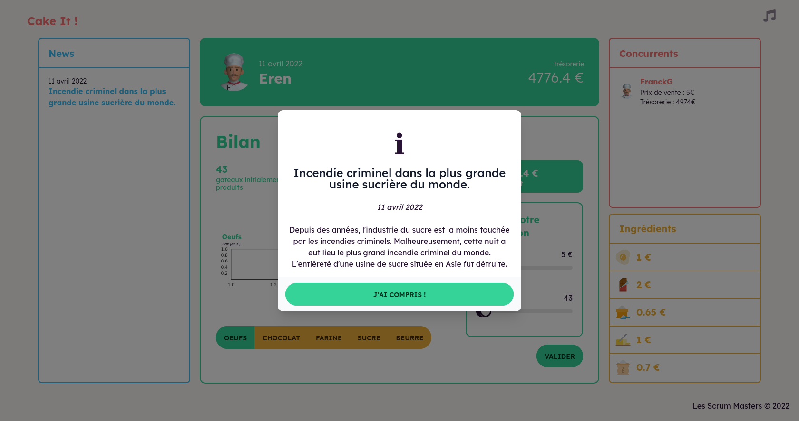
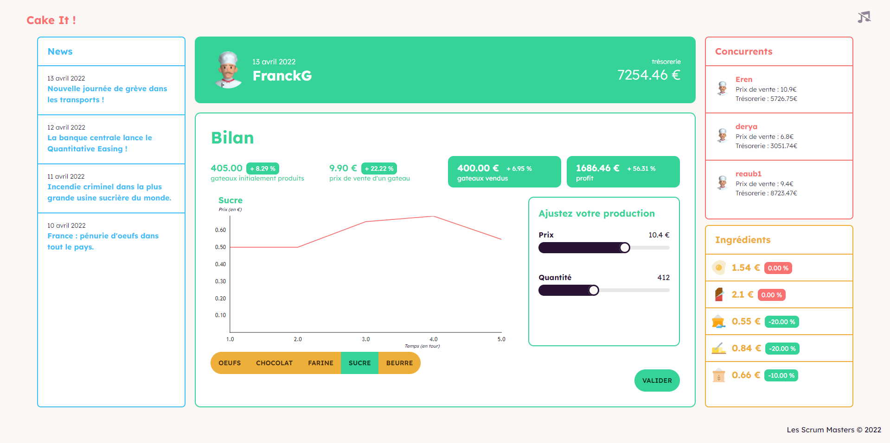
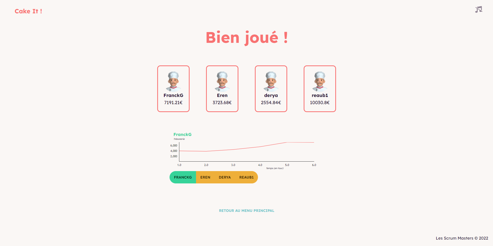

[> Jouer en ligne 🕹️](https://cakeit.franck-g.fr/)

# PEC22-T3-A : Les Scrums Master

- **Thème** : Microéconomie
- **Durée du développement** : 3 jours
- **Nom du jeu** : Cake it !
- **Langage utilisé** : React.js & Node.js

## 📃 Présentation du projet 

**Cake It** est un jeu sérieux montrant comment les mécanismes du marché face aux changements de contextes influent sur les décisions des producteurs.
Entrez dans la peau d'une grande boulangerie qui commercialise des gâteaux aux chocolats et affrontez vos concurrents en gérant au mieux votre production afin de maximiser votre profit !

## **📷 Galerie**

<table>
    <thead>
        <tr>
            <th>Menu principal</th>
            <th>Menu de création de party</th>
        </tr>
    </thead>
    <tbody>
        <tr>
            <td></td>
            <td></td>
        </tr>
    </tbody>
     <thead>
        <tr>
            <th>Lobby d'attente</th>
            <th>Evenement arrivé</th>
        </tr>
    </thead>
    <tbody>
        <tr>
            <td></td>
            <td></td>
        </tr>
    </tbody>
    <thead>
        <tr>
            <th>Menu de jeu</th>
            <th>Fin de partie</th>
        </tr>
    </thead>
    <tbody>
        <tr>
            <td></td>
            <td></td>
        </tr>
    </tbody>
</table>

## ℹ Informations

[Cliquez ici pour accéder au cahier des charges](./CDD.md)

[Cliquez ici pour accéder au cahier des charges version modifiable](https://docs.google.com/document/d/1XzKFFJWGTYIfo0v8qdau2wIX_IKBXGIUGRrV3Ha9yFI/edit#heading=h.lgvm4rpyhbpq)


## 🛠️ Procédure d'installation

### Prérequis

- Installer [Node.js](https://nodejs.org/en/download/)
- Installer [git](https://git-scm.com/downloads) pour pouvoir cloner le projet

### Clôner le projet

Se rendre dans le dossier où vous souhaitez clôner le projet

```bash
cd <chemin>
```

Avec une clé SSH

```bash
git clone git@git.unistra.fr:les-scrums-masters/pec22-t4-a.git
```

Avec HTTPS

```bash
git clone
https://git.unistra.fr/les-scrums-masters/pec22-t4-a.git
```

### Installer les dépendances npm

Au sein des dossiers `/pec22-t4-a/client` et `/pec22-t4-a/server`, exécuter la commande

```
npm install
```

## Démarrer le client 
Au sein du dossier `/pec22-t4-a/client`, exécuter la commande

```
npm run start
```

L'application est alors disponible à l'adresse http://localhost:3000/
